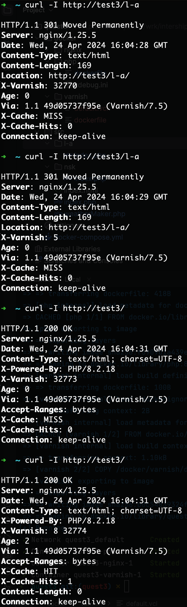

<!-- TOC -->
* [what is?](#what-is)
* [how it run?](#how-it-run)
    * [first:](#first)
    * [second:](#second)
<!-- TOC -->


# what is?
it have `nsk` and `l-a` for showing weather for Novosibirsk and Los Angeles.
Also it cashing data:


# how it run?

### first:
- add your key to `src/weatherMaker.php` as `$apiKey` <br>
- add `test3` to `/etc/hosts`

### second:
just run:
```bash
docker-compose up -d --build 
```


